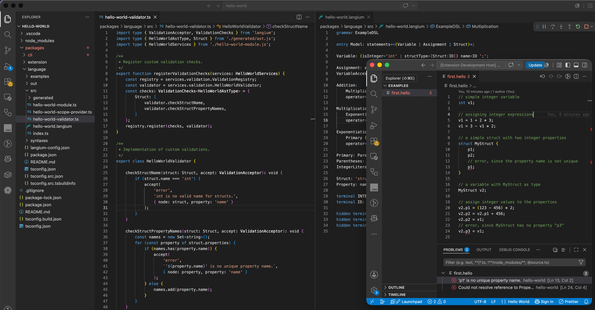

# models-2026-langium-demo

Demo DSL for the Tools&amp;Demo track @ MODELS'26

## Workspace overview

This project contains the implementation of the demo DSL for the demo of "Langium: A TypeScript-Based Language Workbench for Domain-Specific Languages" by Johannes Meier, Steven Smyth, Benjamin F. Wilson, and Insa Fuhrmann at the "Tools and Demonstrations" track at the [MODELS 2026](https://conf.researchr.org/track/models-2026/models-2026-tools-and-demonstrations).

The TypeScript code for the example is structured into these packages:

- [packages/language](./packages/language/README.md) This package contains the language definition.
- [packages/cli](./packages/cli/README.md) contains the command-line interface.
- [packages/extension](./packages/extension/langium-quickstart.md) Contains the VSCode extension.

Some files are contained in the root directory as well:

- [package.json](./package.json) - The manifest file the main workspace package
- [tsconfig.json](./tsconfig.json) - The base TypeScript compiler configuration
- [tsconfig.build.json](./package.json) - Configuration used to build the complete source code.

## Langium grammar

The grammar for the demo DSL is written in the Langium grammar language in the [packages/language/src/hello-world.langium](./packages/language/src/hello-world.langium) file:

```langium
grammar ExampleDSL

entry Model: statements+=(Variable | Assignment | Struct)*;

Variable: (isInteger='int' | structType=[Struct:ID]) name=ID ';';

Assignment: access=VariableAccess '=' value=Addition ';';
VariableAccess: variable=[Variable:ID] ('.' property=[Property:ID])?;

Addition:
	Multiplication ({infer BinaryExpr.left=current}
    operator=('+' | '-') right=Multiplication)*;

Multiplication:
	Exponentiation ({infer BinaryExpr.left=current}
    operator=('*' | '/') right=Exponentiation)*;

Exponentiation:
	Primary ({infer BinaryExpr.left=current}
    operator='^' right=Exponentiation)?;

Primary: Parentheses | IntegerLiteral | VariableAccess;
Parentheses: '(' expr=Addition ')';
IntegerLiteral: value=INTEGER;

Struct: 'struct' name=ID '{' properties+=Property* '}';
Property: name=ID ';';

terminal INTEGER returns number: /[0-9]+(\.[0-9]+)?/;
terminal ID: /[_a-zA-Z][\w_]*/;

hidden terminal WS: /\s+/;
hidden terminal ML_COMMENT: /\/\*[\s\S]*?\*\//;
hidden terminal SL_COMMENT: /\/\/[^\n\r]*/;
```

## Run the example

Read [this guide](./packages/cli/README.md) how to start the editor for the demo DSL.
It is started as VS Code extension and should look like this:



For a quick-start of the code generation, execute:
````
node ./packages/cli/bin/cli generate ./packages/language/examples/first.hello -d ./packages/language/examples
```
